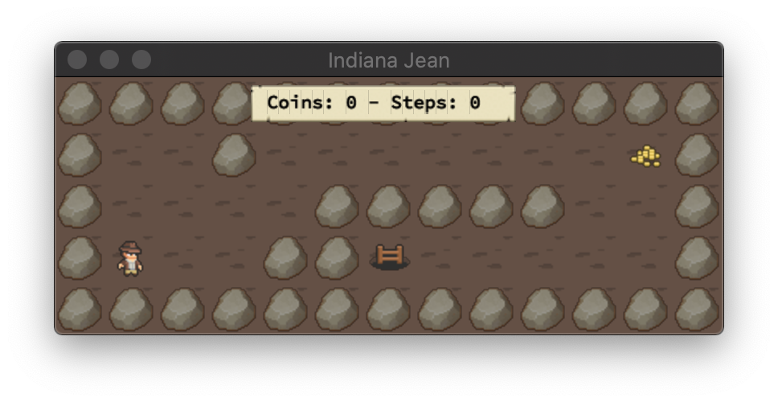
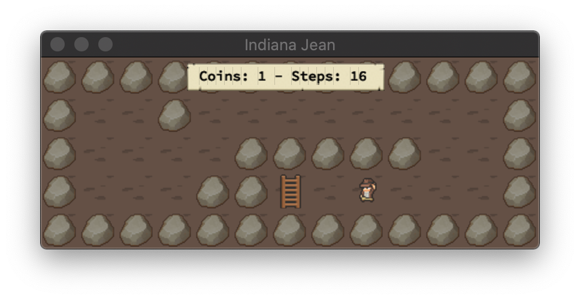

<h1 align="center">
     </br>
    Project n°5 - so_long
    <h4 align="center" style="width: 50%; margin: 2rem auto; font-weight: normal;">
    his project is a very small 2D game. It is built to learn how to work with textures, sprites. And some very basic gameplay elements.
    </h4>
</h1>

<p align="center">
  
</p>

## Goals

This project’s objectives are similar to all this first year’s objectives: Rigor, use of C, use
of basic algorithms, information research etc.

As a graphic design project, so long will enable improve skills in these
areas: windows, colors, events, textures, etc.

## Run the program

```shell
git clone https://github.com/MarJC5/so_long.git
cd ./so_long/so_long #Move to the game folder
make && ./so_long ./map/bonus/small.ber  #Compile and Run the game
```

## Mandatory part

- The map will be constructed with 3 components walls, collectibles, and free space.
- The player’s goal is to collect all collectibles present on the map then escape with minimal movement.
- At every move the current number of movements must be displayed in the shell.
- The player must be able to move: up, down, left, right.
- You will use a 2D view (top-down or profile).
- The game doesn’t need to be real-time.
- player cannot move into walls.
- The program displays the image in a window and respects the following rules:
  - The `W`, `A`, `S`, and `D` keys will be used to move the main character.
  - Pressing `ESC` must close the window and quit the program cleanly.
  - Clicking on the red cross on the window’s frame must close the window and quit the program cleanly.

## Map

The map must be composed of only 5 possible characters: ``0`` for an empty space, ``1`` for a wall, ``C`` for a collectible, ``E`` for map exit and ``P`` for the player’s starting position.

This is a simple valid map:

```nano
1111111111111
10010000000C1
1000011111001
1P0011E000001
1111111111111
```

## Bonus part
- There’s some enemy animation.
- There’s some sprite animation.
- The player can kill enemy by pressing `P`.
- Movement count is directly displayed on the screen instead of shell output.

<p align="center">
  
</p>
